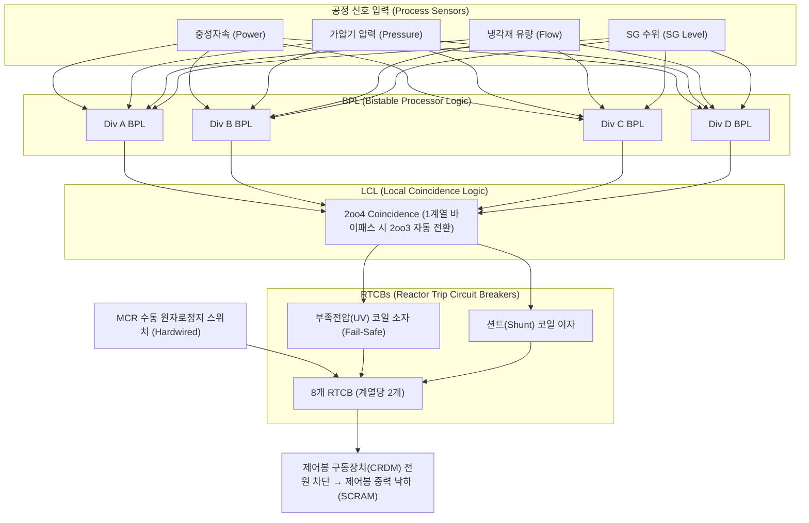

# Westinghouse AP1000 Reactor Protection System (PMS/RTS) Simulator

[](#안전성-검증-체계-ieee-7-432--iec-60880--stpa)
[](#도우미-llm-엔지니어-cerebras-초고속-추론-기반-자문)
[](#docker-빌드-및-실행)

본 프로젝트는 **Westinghouse AP1000 원전의 보호 및 안전감시계통(PMS, Protection and Safety Monitoring System)** 내 **원자로보호계통(RTS, Reactor Trip System)**을 모의하는 교육 및 연구용 시뮬레이션 플랫폼입니다.

미국 원자력규제위원회(NRC)의 AP1000 Final Safety Evaluation Report (NUREG-1793 Supplement 2, Chapter 7 및 Appendix 7A)를 설계 근거로 하여 4개 독립 중복 계열, 2-out-of-4 (2oo4) 일치 투표 논리, 정비 바이패스 시 2oo3 전환 논리, 및 원자로정지차단기(RTCB) 개방 메커니즘을 충실하게 구현하였습니다.

---

## 🏛 에이전트 팀 구성 (Autonomous Engineering Team)

본 프로젝트는 원자력 소프트웨어 개발 및 안전성 검증 라이프사이클에 맞추어 전문 에이전트 팀을 구성하여 개발되었습니다.

| 역할 (Role) | 주요 책임 및 구현 내용 |
|---|---|
| **System Architect & Nuclear Safety Lead** | NUREG-1793 Supp 2 Ch 7 기반 AP1000 PMS/RTS 논리 정합성 수립, IEEE 7-4.3.2 / IEC 60880 / STPA 안전제약 추적성 총괄 |
| **Backend Engineer** | 4계열 BPL/LCL 엔진, 19개 보호기능 처리, 2oo4/2oo3 동적 투표, UV/Shunt 코일 작동, 정지 래치 및 재폐로 인터록, SSE 스트리밍 |
| **Frontend Engineer** | 원전 주제어실(MCR) 콘솔 UI, 4계열 상태반, 2oo4 투표 매트릭스, 차단기 동작선도, 공정 파라미터 트렌드, 보호 커버 수동정지 스위치 |
| **Database Engineer** | SQLite WAL 모드 기반 원자적 스냅샷 영속화, 밀리초 단위 SOE(Sequence of Events) 감사 로그, 시뮬레이터 재시작 복원력 |
| **LLM Engineer** | **Cerebras 초고속 추론 엔진** 연동, AP1000 기술지침서 및 STPA 기반 실시간 안전 진단, 읽기 전용 안전 경계 격리 |
| **Safety & Verification Engineer** | IEEE 7-4.3.2 단일고장/독립성, IEC 60880 Cat-A SW 경계값 방어, STPA UCA-01~10 위험제어 자동화 테스트 스위트 (158개 테스트 전수 통과) |
| **DevOps Engineer** | Next.js 정적 빌드 + Python 3.12 런타임 멀티스테이지 Dockerfile, Docker Compose 환경, 컨테이너 헬스체크 구성 |

---

## ⚛ 시스템 핵심 기능 (Core Protection Features)



1. **4개 독립 중복 계열 (Divisions A, B, C, D)**
   - 계열 간 통신 및 연산이 철저히 격리되어 단일 계열 고장 시에도 전체 보호기능이 정상 유지됩니다.
2. **동일 기능 2oo4 / 2oo3 일치 논리 (Coincidence Logic)**
   - 동일 보호기능의 4개 계열 중 2개 이상이 트립을 감지할 때만 원자로정지 신호를 발령합니다.
   - 서로 다른 보호기능 간의 표는 절대 결합되지 않습니다 (오투표 방지).
   - 정비 바이패스(Maintenance Bypass) 적용 시 잔여 3계열 간 2oo3 투표로 자동 전환되며, 안전성 저하를 방지하기 위해 2개 이상 계열의 동시 바이패스는 인터록에 의해 엄격히 거부됩니다.
3. **원자로정지차단기(RTCB) 이중 작동 경로**
   - 자동 정지 요구 시 부족전압(UV, Undervoltage) 코일을 소자(De-energize, Fail-safe)함과 동시에 션트(Shunt Trip) 장치를 여자(Energize)하여 신뢰성을 극대화합니다.
   - 2개 계열 이상의 차단기가 개방되면 제어봉 구동장치(CRDM) 전원이 차단되어 제어봉이 중력에 의해 노심으로 낙하합니다.
4. **엄격한 트립 래치 및 복구 인터록 (Trip Latch & Reclose Interlock)**
   - 기동 조건이 소멸하더라도 트립 상태는 래치되어 유지됩니다.
   - 복구 순서: `위험 입력 신호 정상화` → `수동 신호 복귀` → `Trip Reset` → `차단기 재폐로(Reclose)`.

---

## ⚡ 도우미 LLM 엔지니어: Cerebras 초고속 추론 기반 자문

- **Cerebras Inference Engine 연동:**
  - OpenRouter의 Cerebras 초고속 Llama-3.3-70B / Llama-3.1-8B 추론 파이프라인 탑재.
  - 지연 시간 수백 밀리초 단위의 즉각적인 원전 상태 진단 제공.
- **철저한 읽기 전용(Read-Only) 안전 경계:**
  - LLM은 시뮬레이터 조작, 리셋, 바이패스, 설정 변경 권한을 일체 갖지 않습니다.
  - 악의적인 프롬프트 주입(Prompt Injection) 시도에도 시뮬레이터 내부 상태가 100% 보존됩니다 (STPA UCA-08 검증 통과).
- **결정론적 오프라인 폴백:**
  - 외부 네트워크 단절이나 API 키 미설정 시에도 내장된 결정론적 안전 규칙 엔진을 통해 정확한 한국어 자문을 즉시 제공합니다.

---

## 🛡 안전성 검증 체계 (IEEE 7-4.3.2 / IEC 60880 / STPA)

본 저장소에는 총 **158개의 자동화된 안전성 및 적합성 검증 테스트**가 포함되어 있으며 전수 통과(100% Pass)합니다.

### 1. IEEE 7-4.3.2-2016 디지털 원자력 안전계통 요건 검증 (`test_ieee_7_4_3_2.py`)
- **Clause 5.1 Single Failure Criterion:** 단일 차단기 고착(Stuck Breaker), 단일 계측기 고장 시에도 잔여 계열에 의해 원자로정지 보장.
- **Clause 5.3 Independence:** 계열 간 데이터 격리 및 이종 보호기능 간 간섭 차단.
- **Clause 5.5 Deterministic Timing:** 정주기 스캔 루프 및 원자적(Atomic) 상태 전이 검증.
- **Clause 5.7 Fail-Safe State:** 계열 전원 상실 시 부족전압(UV) 코일 자동 소자 및 안전 차단기 개방.
- **Clause 5.9 Maintenance Bypass:** 1개 계열 바이패스 시 2oo3 전환 및 2개 계열 동시 바이패스 차단.

### 2. IEC 60880:2006 Category A 소프트웨어 안전 수명주기 검증 (`test_iec_60880.py`)
- **Clause 5 Requirements Traceability:** NUREG-1793 Supp 2 Ch 7에 명시된 19개 보호기능 전수 등록 및 상태 검증.
- **Clause 7 Defensive Programming:** NaN, Inf, 음수, 비정상 범위(0~100 벗어남) 입력 즉각 거부 및 원자적 롤백.
- **Clause 8 Interlock Integrity:** 원자로정지 래치 지속성 및 기동 조건 잔존 시 리셋 거부 인터록.
- **Clause 9 Deterministic Persistence:** SQLite WAL 트랜잭션 및 밀리초 단위 SOE(Sequence of Events) 감사 추적.

### 3. STPA (STAMP) Unsafe Control Action (UCA) 검증 (`test_stpa.py`)
- **UCA-01 (Trip Not Provided):** 위험 과도상태에서 정지가 누락되는 Hazard H1 방지 (16개 전수 조합 검증).
- **UCA-02 (Spurious Trip):** 노이즈에 의한 오정지 Hazard H5 방지 (이종 기능 오투표 결합 원천 차단).
- **UCA-03 (Premature Reset):** 위험 잔존 시 성급한 리셋으로 안전을 훼손하는 Hazard H2 차단.
- **UCA-04 (Multi-Bypass):** 다중 우회로 인한 보호능력 상실 차단.
- **UCA-05 (Trip Delayed):** LLM 보조 프로세스 지연이 원자로보호 핵심 루프를 블로킹하지 않음.
- **UCA-06 (Manual Trip Unavailable):** 자동 센서 경로 고장 시에도 MCR 수동정지 직결 경로 보장.
- **UCA-07 (Stale Feedback):** 계측기 불량 및 바이패스 상태 실시간 알람 경보화.
- **UCA-08 (AI Actuation Injection):** LLM 프롬프트 주입 공격을 통한 안전계통 조작 시도 원천 무력화.

---

## 🚀 빠른 시작 (Quickstart)

### 방법 1: Docker Compose 실행 (권장)

```bash
# 저장소 클론
git clone https://github.com/jsyssdsh/AP1000-RPS.git
cd AP1000-RPS

# 도커 빌드 및 백그라운드 실행
docker compose up -d --build

# 컨테이너 상태 및 헬스체크 확인
docker compose ps

# 웹 브라우저 접속 (기본 포트: 8080, PORT 환경변수로 변경 가능)
# URL: http://localhost:8080
```

### 방법 2: 로컬 파이썬 및 Node 개발 환경

```bash
# 1. 프론트엔드 빌드 (Next.js Static Export)
cd frontend
npm install
npm run build
cd ..

# 2. 백엔드 가상환경 및 패키지 설치
cd backend
pip install -r requirements.txt

# 3. 전체 158개 안전성 테스트 실행
python -m pytest tests -v

# 4. 백엔드 시뮬레이터 서버 기동
python -m uvicorn app.main:app --host 0.0.0.0 --port 8000
```

---

## 📋 API 명세 요약

- `GET /api/health`: 시뮬레이터 헬스체크 상태 반환
- `GET /api/state`: 현재 원자로보호계통 4계열 및 19개 보호기능 상태 스냅샷
- `GET /api/stream`: Server-Sent Events (SSE) 실시간 시뮬레이션 텔레메트리 스트림
- `GET /api/catalog`: AP1000 19개 보호기능 카탈로그
- `POST /api/command`: 시뮬레이터 명령 (시나리오 변경, 수동정지, 리셋, 재폐로, 바이패스, 고장주입)
- `POST /api/chat`: Cerebras 기반 실시간 원전 안전 자문 챗 엔드포인트
- `GET /api/safety-tests`: IEEE 7-4.3.2, IEC 60880, STPA 전체 안전성 테스트 즉시 실행 및 리포트 반환
- `GET /api/events`: 밀리초 단위 SOE 이벤트 감사 로그 조회

---

## 📜 라이선스 및 면책조항

- 본 소프트웨어는 Westinghouse AP1000 PMS 공개 설계보고서(NUREG-1793 Supp 2)를 기반으로 연구 및 교육 목적으로 제작되었습니다.
- 실제 상용 원자력 발전소 운전이나 규제기관 공인 인증을 대체할 수 없습니다.
