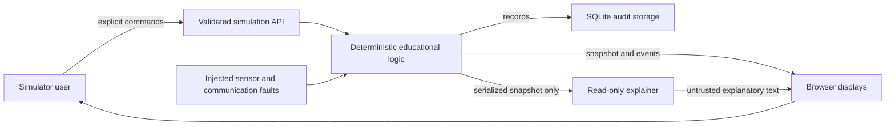

# Educational simulator safety case and STPA review

Baseline: 2026-09-18. Scope: browser/FastAPI/SQLite simulation only.

**This is not an operational reactor protection system, a qualified AP1000 implementation, or a standards compliance certificate.** Its simulation inputs, setpoints, timing and plant dynamics are illustrative. There is no hardware interface. The project planning document distinguishes source requirements, derived requirements and unresolved design data; this implementation preserves that distinction. The original PDF identified there is not supplied here, and its asserted page-level evidence has not been independently reverified.

## Source basis and evidence limits

1. [NRC Regulatory Guide 1.152 publication history](https://www.nrc.gov/reading-rm/doc-collections/reg-guides/power-reactors/rg/division-1/division-1-141) identifies revision 4, July 2023. [NRC RG 1.152 revision 4](https://downloads.regulations.gov/NRC-2022-0143-0008/content.pdf) provides the NRC's guidance concerning IEEE 7-4.3.2-2016. The NRC endorsement includes exceptions and clarifications; a simulator test cannot establish compliance with the standard or regulatory guidance.
2. [IEC 60880:2006 official catalog](https://webstore.iec.ch/en/publication/3795) describes software requirements for computer-based nuclear I&C performing category A functions. The full licensed standard has not been acquired or reviewed. The matrix below is a thematic engineering review, not a clause-by-clause audit.
3. [MIT STPA Handbook](https://psas.scripts.mit.edu/home/books-and-handbooks/) supplies the method: define losses/hazards, model the control structure, identify unsafe control actions and analyze causal scenarios. STPA is a hazard-analysis method, not certification or a standalone executable test standard.
4. [Local AP1000 planning baseline](../planning/AP1000-RPS.md) identifies 2oo4 / allowed 2oo3 abstraction, same-function voting, UV/shunt semantics and unresolved AP1000 calculations/circuit details. Document IDs below refer to that baseline, not newly verified plant requirements.

## Control structure and boundary

The LLM receives data and produces text. It has no tools, engine reference, command dispatcher or database write capability. External provider delay/failure must not become a prerequisite for simulation stepping or manual trip. Logical separation in one software process is not electrical, physical or qualified functional independence.

## Losses and hazardous simulation states

| ID | Loss / hazard |
|---|---|
| L1 | User learns an incorrect protection rule or mistakes illustrative results for approved plant behavior. |
| L2 | User loses a reliable sequence of simulation evidence or cannot reproduce an experiment. |
| L3 | Explanatory AI text is mistaken for executed action or an approved operating instruction. |
| H1 | A modeled valid same-function demand is present while modeled trip remains absent (L1). |
| H2 | Trip is removed or protection degraded while a demand remains (L1). |
| H3 | Stale, missing or invalid data is presented as current and healthy (L1, L2). |
| H4 | UI, logging or assistant failures alter or conceal protection behavior (L1–L3). |
| H5 | Demonstration values, unimplemented functions or tests are represented as qualified AP1000 results (L1, L3). |

## Unsafe control actions, constraints and verification intentions

| UCA | Context / unsafe action | Constraint | Evidence target |
|---|---|---|---|
| UCA-01: not provided | Same function votes in two active divisions, but trip is withheld (H1). | SC-01: Exhaustively verify all 16 normal vote combinations against independent count oracle. | LOG-01; engine voting tests. |
| UCA-02: provided incorrectly | Unrelated single-function votes combine into a false coincidence (H5). | SC-02: Coincidence groups retain function identity. | LOG-02; mixed-function test. |
| UCA-03: stopped too soon | Reset clears trip while demand remains; loss of input automatically clears latch (H2). | SC-03: Demand disappearance alone cannot clear latch; reset rejects active causes. | ACT-07 / FLT-06; latch/reset tests. |
| UCA-04: provided incorrectly | A second simultaneous division bypass is accepted (H2). | SC-04: At most one allowed bypass; remaining identical-function votes require 2oo3. | BYP / LOG-01; bypass combinations and rejection tests. |
| UCA-05: too late | Assistant or browser response is awaited before evaluating trip (H1, H4). | SC-05: Protection model has no LLM dependency; provider failures yield explanations only. | Architecture review; assistant failure tests; concurrent API checks. |
| UCA-06: not provided | Manual trip is unavailable while a modeled automatic path is failed (H1). | SC-06: Manual trip is a distinct modeled command. Physical hardwiring is outside scope. | ACT-04–06; manual trip tests. |
| UCA-07: incorrect feedback | Bad/stale samples remain apparently healthy, or stale browser state appears live (H3). | SC-07: Model faults explicitly; reject malformed inputs; show connection freshness. | COM-05 / FLT; fault and API validation tests; UI review. |
| UCA-08: provided incorrectly | AI response is interpreted as an executed bypass/reset or plant instruction (H4, H5). | SC-08: Assistant receives snapshot copies and no action tools; every response identifies read-only status. | `test_offline_explanation_cannot_mutate_state`, `test_provider_locked_to_cerebras_and_no_tools`. |
| UCA-09: incorrect feedback | Provider error exposes credentials or fabricates online success (H4). | SC-09: Redact errors, mark offline mode explicitly; never fall back silently to a different inference provider. | `test_provider_failure_redacts_details_and_falls_back`. |
| UCA-10: wrong order | Concurrent requests apply reset/bypass using inconsistent state (H2). | SC-10: Serialize state transitions and event ordering. | API lock/code review; integration checks. |

### Causal scenarios and residual risks

- Common software defect affects all four modeled divisions: exhaustive truth tables find some logic defects but do not demonstrate diversity or eliminate common-cause failure. Physical division independence and D3 remain open.
- Permissive, reset or sensor-quality policy is incorrectly inferred from another reactor design: label model policies as assumptions and retain planning TBD-02 through TBD-08. A blanket BAD-sensor-trip rule cannot be asserted as AP1000 behavior, especially for TC BAD quality (CAL-06).
- Numerical overflow, NaN or non-finite input defeats a comparator: enforce finite bounded inputs and include rejection tests. Detailed uncertainty and approved OTΔT/OPΔT enthalpy tables remain open; this model cannot claim CAL-01 through CAL-09 completion.
- Browser disconnect or background throttling hides a new event: show stale/offline status; recover from an authoritative snapshot. Browser rendering times are not safety response-time measurements.
- Database error prevents recording a command: report degradation explicitly; review whether the in-memory state already changed. SQLite transactions protect database consistency but cannot atomically commit physical plant action, which is absent here.
- Prompt injection asks the assistant to operate protection: architectural absence of control capabilities prevents actual operation. Text quality remains probabilistic and must not be treated as a safety function.

## IEEE / IEC thematic review

| Review topic | Simulator evidence | Explicit gap |
|---|---|---|
| Requirements and traceability | Planning IDs, SC/UCA matrix, named automated tests. | Approved plant baseline and complete licensed standards review unavailable. |
| Deterministic behavior | Pure logic tests, explicit state transitions and fault scenarios. | No qualified scheduler, WCET, scan/deadline, Chapter 15 or hardware timing demonstration. |
| Independence / interference | LLM data-only boundary and distinct display/persistence responsibilities. | Single host/process; no electrical isolation, seismic/EMC/environmental qualification. |
| Fault handling and defense | Modeled faults, validation, bypass limits and latch verification. | No complete plant FMEA, SHA, D3 or hardware single-failure proof. |
| Software verification | Automated unit/integration tests and reproducible Docker build/run. | No organizationally independent V&V, tool qualification or regulator acceptance. |
| Configuration and lifecycle | Version-controlled sources, documented assumptions, test commands. | No approved nuclear QA program, signed lifecycle review or qualified supply chain. |
| Communication / data integrity | Validated API inputs, snapshot/event records, fault labels. | No qualified HSL/HDLC implementation or real packet integrity/latency proof. |

## Test execution and interpretation

Run the complete backend suite using `python -m pytest backend/tests -v` with `PYTHONPATH=backend`, or the repository's Docker test command. The final generated test report records the actual executed checks and counts. A test listed above is a verification target until that corresponding check is implemented and passes. Test passing means agreement with the documented simulation model only.

Before any use beyond education, obtain the plant-specific design baseline, full standards and applicable editions; resolve all planning TBDs; perform independent V&V, hardware integration/HIL, timing/qualification, human-factors and cyber-security analyses under an appropriate nuclear QA program. No present artifact claims these activities were completed.
