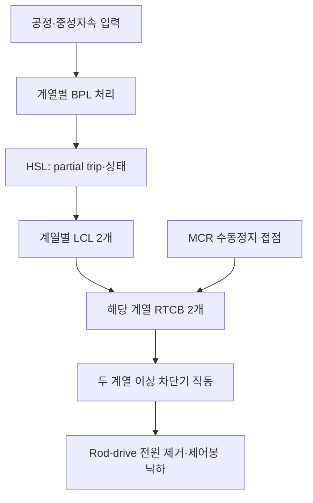

# AP1000 Reactor Protection System 개발 명세서

- 요청 파일명: `APR1000-RPS.md`
- 실제 대상 노형: **Westinghouse AP1000**
- 버전: 0.1 / 검토용 개발 초안
- 작성일: 2026-09-18
- 근거: 첨부 NUREG-1793, Volume 1, Supplement 2, Chapters 4–8 중 Chapter 7 및 Appendix 7A

> **노형·자료 구분:** 사용자가 지정한 파일명은 유지하였다. 그러나 첨부 자료는 APR1000의 FSAR가 아니라 **AP1000 설계인증 관련 NRC Final Safety Evaluation Report(FSER)**이다. 따라서 본문은 AP1000 PMS 내 원자로정지 기능을 대상으로 한다. APR1000 또는 APR1400의 설계로 전용할 수 없다. 또한 이 문서는 평가보고서에 근거한 개발 출발점이며, 승인된 상세 기능·설정치·회로 명세를 대체하지 않는다.

## 1. 목적, 근거 및 적용 범위

### 1.1 목적

AP1000 원자로 보호 기능을 개발하기 위해 확인 가능한 기능 요구, 보호 아키텍처, 인터페이스, 수치 처리, 고장 대응, 시험 및 추적성 요구를 정리한다. 원문에서 확인된 사항과 추가 설계가 필요한 사항을 분리하여 구현 과정에서 다른 노형의 논리나 임의 설정값이 혼입되는 것을 방지한다.

이 문서에서 RPS는 개발 대상 보호 기능을 지칭한다. 원문 명칭인 **Reactor Trip System(RTS)**와 이를 포함하는 **Protection and Safety Monitoring System(PMS)**를 구분해 사용한다.

### 1.2 원문 식별

| 항목 | 값 |
|---|---|
| 출처 ID | S1 |
| 첨부 파일 | `89542a00-62bc-48c1-97b0-f5f1c30411e0.pdf` |
| PDF 제목 메타데이터 | NUREG-1793 Vol 1 Supp 2, (2 of 2), Final Safety Evaluation Report Related to Certification of the AP1000 Standard Plant Design (Chapters 4–8) |
| 전체 페이지 | 280 |
| SHA-256 | `deb578e37c5d5bbb1f796ee765e240392668622745d175bdc109436c9bbe8343` |
| 핵심 근거 | §§7.2.2, 7.2.5, 7.2.7, 7.8, 7.9 및 Appendix 7A |
| 자료 성격 | 설계 변경 및 관련 심사 결과를 포함하는 NRC 평가보고서 |

`[S1: §7.2.2.2.1, p.7-12]`처럼 절과 인쇄 페이지를 인용한다. Chapter 7의 인쇄 `7-n` 페이지는 첨부 PDF의 `n+162` 페이지에 해당한다. 예: p.7-8 = PDF 170, p.7-12 = PDF 174, p.7-97 = PDF 259.

스캔 OCR에는 `2oo4 → 2004`, `BPL → SPL`, `RTCB → RTCS`, `D → O`와 같은 오인식이 있다. 구조·수량·극성에 중요한 항목은 페이지 이미지와 문맥으로 확인하였다. 참조 보고서 전문이나 현재 적용 호기의 최종 설계 기준선을 확인한 것으로 간주하지 않는다.

### 1.3 요구 수준

| 표기 | 의미 |
|---|---|
| **원문** | 첨부 FSER에 직접 기술된 설계 또는 심사 내용 |
| **도출** | 원문을 구현·검증 가능한 형태로 구체화한 개발 요구 |
| **제안** | 개발 편의를 위한 모듈·기록·검증 구조 |
| **TBD** | 첨부 자료만으로 확정할 수 없는 상세 사항 |

NRC가 원 설계를 수용했다는 설명을 이 문서에 따라 새로 작성한 소프트웨어의 승인으로 해석하지 않는다. 인용된 법령·표준 판본은 해당 심사의 역사적 기준이며, 현재 프로젝트에 적용할 판본은 별도 확정한다.

## 2. 시스템 경계와 주요 용어

### 2.1 범위

| 영역 | 포함하는 개발 내용 | 별도 확보·설계할 내용 |
|---|---|---|
| 입력·BPL | 신호 획득, 단위 변환, 보호 계산, 설정치 비교 | 전체 I/O 목록, 센서 모델·불확도·배선 |
| LCL | 부분 trip의 coincidence 판단, bypass 연계 | 상세 채널 결합·출력 회로 및 모든 기능별 예외 |
| RTS 출력 | 계열별 RTCB 작동, UV/shunt 경로 | 실제 차단기 결선, 전원, relay 극성·지연 |
| 수동정지 | MCR hardwired 정지 경로 | 스위치 수량·조합·접점 상세 및 RSR 경로 |
| ESFAS 연계 | ADS/CMT/safeguards actuation의 reactor trip 연계 | ESFAS 전체 작동·시퀀스·기기 제어 |
| PMS 감시·시험 | 상태, bypass, 설정 변경, 시험 접근 | HMI 화면·알람 우선순위·전체 시험 절차 |
| DAS | PMS와 독립된 다양성 보호 경계 | DAS 상세 알고리즘·플랫폼 구현 |
| PLS 등 비안전계통 | 데이터 전달과 간섭 방지 | 발전소 제어 전체 구현 |

### 2.2 용어

| 약어 | 의미 |
|---|---|
| PMS | Protection and Safety Monitoring System |
| RTS | Reactor Trip System |
| BPL | Bistable Processor Logic |
| LCL | Local Coincidence Logic |
| RTCB | Reactor Trip Circuit Breaker |
| MTP | Maintenance and Test Panel |
| ITP | Integrated Test Processor — 본 AP1000 문서의 명칭 |
| HSL / AF100 | High-Speed Link / 계열 내 통신 버스 |
| ESFAS | Engineered Safety Features Actuation System |
| ILP / SRNC / CIM | Integrated Logic Processor / Safety-Related Node Controller / Component Interface Module |
| PLS / DAS | Plant Control System / Diverse Actuation System |
| OTΔT / OPΔT | Overtemperature delta-T / Overpower delta-T 보호기능 |
| ADS / CMT | Automatic Depressurization System / Core Makeup Tank |
| MCR / RSR | Main Control Room / Remote Shutdown Room |
| TS / COL / ITAAC | Technical Specifications / Combined License / Inspections, Tests, Analyses, and Acceptance Criteria |

## 3. 보호 아키텍처

### 3.1 원문 구조

| ID | 수준 | 요구사항 | 근거 |
|---|---|---|---|
| ARC-01 | 원문 | PMS는 A, B, C, D 네 중복 계열로 구성한다. | §7.2.2.2, p.7-11 |
| ARC-02 | 원문 | 각 계열은 두 중복 채널을 가지며, 해당 계열 측정값을 BPL에서 처리한다. | §7.2.2.2, pp.7-11~12 |
| ARC-03 | 원문 | 계열당 두 LCL 프로세서가 각 계열 BPL 출력을 수신한다. | §7.2.2.2, p.7-12 |
| ARC-04 | 원문 | PMS 보호 플랫폼은 Common Q이며 Eagle 21을 사용한다는 이전 참조를 제거하였다. | §7.2.2, p.7-7 |
| ARC-05 | 원문 | 정상적인 네 계열 coincidence는 2oo4이며 허용된 bypass 구성에서는 2oo3으로 전환한다. | §7.2.2.2, p.7-11 |
| ARC-06 | 원문 | 각 계열은 두 RTCB를 제어하며, 적절한 차단기를 두 계열 이상에서 개방하면 rod-drive coil 전원이 제거된다. | §7.2.2.2.1, p.7-12 |
| ARC-07 | 원문 | 자동 trip demand는 RTCB undervoltage coil을 de-energize하고 shunt trip 장치를 energize한다. 어느 작동도 차단기를 trip시킨다. | 같은 절 |
| ARC-08 | 도출 | 기능·전원·통신·물리적 독립성을 각각 입증한다. 소프트웨어 객체 네 개로 실제 네 계열 독립성을 대체하지 않는다. | §7.2.2.3.6 및 §7.9 |



그림은 기능 경로의 요약이다. 이 자료만으로 BPL 중복 채널의 Boolean 결합, LCL 두 출력의 결합 및 전체 차단기 결선을 확정하지 않는다.

### 3.2 이전 APR1400 명세와 혼입 금지

- APR1400의 계열당 LCL 4개와 selective 2oo4 식을 이 시스템에 적용하지 않는다. 본 첨부 문서는 AP1000의 계열당 LCL 2개를 설명한다.
- AP1000 자동 RTS는 UV와 shunt 장치를 모두 작동시킨다. “RPS는 UV만, 다양성 보호는 shunt만”이라는 다른 노형의 배분을 복사하지 않는다.
- AP1000의 OTΔT/OPΔT를 APR1400 CPCS의 DNBR/LPD 계산으로 대체하지 않는다.
- APR1400의 바이패스 임계값·nominal setpoint·응답시간 표를 이 문서의 기본값으로 사용하지 않는다.

## 4. 보호기능 요구사항

원문 §7.2.2.1.1은 다음 19개 항목을 열거하며 마지막 항목은 수동정지이다. 이는 **기능 목록의 개수**로서 실제 센서·BPL·보호변수 인스턴스 개수와 같다는 뜻은 아니다.

| ID | 보호기능 | 입력·처리 개요 | 추가 확정 사항 |
|---|---|---|---|
| FUN-01 | Source-range high neutron flux | 선원영역 중성자속 | HV 인가 후 지연, operable 판정, 범위 전환 |
| FUN-02 | Intermediate-range high neutron flux | 중간영역 중성자속 | threshold, permissive 및 channel 구성 |
| FUN-03 | Power-range high neutron flux, low setpoint | 출력영역 중성자속 | 저설정치·활성 범위 |
| FUN-04 | Power-range high neutron flux, high setpoint | 출력영역 중성자속 | 고설정치·복귀 조건 |
| FUN-05 | Power-range high positive flux rate | 양의 중성자속 변화율 | 미분·필터·단위·판정 시간 |
| FUN-06 | OTΔT | 열출력 계산과 DNB 관련 허용 출력 비교 | thermal-limit table·동적 보상 |
| FUN-07 | OPΔT | 열출력 계산과 허용 출력 비교 | 출력 bias·axial-offset 영향·보상 |
| FUN-08 | Low pressurizer pressure | 가압기 저압 | 설정치·permissive |
| FUN-09 | Low reactor coolant flow | 원자로 냉각재 저유량 | 센서·유량 계산·채널별 논리 |
| FUN-10 | RCP underspeed | 펌프 저속 | 펌프별 입력 및 결합 |
| FUN-11 | High RCP bearing water temperature | 펌프 베어링 냉각수 고온 | 펌프별 비교·aggregation |
| FUN-12 | High pressurizer pressure | 가압기 고압 | 설정치·불확도 |
| FUN-13 | High pressurizer water level | 가압기 고수위 | 계측 범위·설정치 |
| FUN-14 | Low water level in any SG | 어느 SG의 저수위 | SG별 측정·동일 변수 투표 |
| FUN-15 | High-2 water level in any SG | 어느 SG의 high-2 수위 | high-1과 구분, SG별 논리 |
| FUN-16 | ADS actuation trip | ADS 작동 연계 | 작동 단계·신호 발생점·극성 |
| FUN-17 | CMT actuation trip | CMT 작동 연계 | 연계 신호·판정점 |
| FUN-18 | Safeguards actuation trip | safeguards actuation | 포함 작동 목록·중복 입력 관계 |
| FUN-19 | Manual reactor trip | 수동 hardwired 요청 | 스위치·접점·회로 매핑 |

[S1: §7.2.2.1.1, pp.7-8~9]

### 4.1 문서에 명시된 변경사항

| ID | 수준 | 요구사항 |
|---|---|---|
| MOD-01 | 원문 | 선원영역 검출기 고전압 전원 인가 시 오정지를 방지하기 위해 source-range high flux trip을 지연한다. 검출기는 operable 선언 전에 전원이 인가되어야 한다. 지연 수치는 TBD이다. |
| MOD-02 | 원문 | P-8은 P-10과 중복되어 제거된 것으로 기술된다. P-8을 관행적으로 복원하지 않는다. |
| MOD-03 | 원문 | 어느 RCP의 bearing water temperature가 높은 경우의 trip은 저출력에서 P-10으로 차단되지 않도록 변경되었다. |
| MOD-04 | 원문 | 음의 flux rate에 따른 자동 rod-withdrawal block 및 관련 P-17 사용은 제거된 것으로 설명한다. 다른 노형의 인출금지 로직을 복사하지 않는다. |
| MOD-05 | 도출 | 각 변경은 적용 DCD 개정과 대조하여 요구 기준선에 기록한다. 평가보고서의 변경 이력을 전체 최종 logic diagram으로 간주하지 않는다. |

[S1: §7.2.2.1.1, pp.7-8~9]

## 5. OTΔT·OPΔT 계산 요구

### 5.1 디지털 계산 방식

Appendix 7A는 단순한 `TH − TC > 상수` 비교보다 구체적인 디지털 방식을 설명한다.

1. 출구 온도 TH, 입구 온도 TC 및 가압기 압력을 이용하여 입·출구 **엔탈피 차이에 기반한 노심 열출력**을 계산한다.
2. OTΔT 설정치는 TC와 가압기 압력에 따른 허용 정격열출력(RTP)을 thermal design-limit table에서 선형 보간하여 구한다.
3. 계산된 열출력과 설정치로부터 동적 보상을 거친 margin-to-trip을 산출한다.
4. OPΔT 설정치는 결정된 출력 수준으로 수동 고정되며 adverse axial offset의 영향을 받는다.
5. Margin-to-trip은 bistable 입력과 MCR 경보·표시에 제공된다. 원문은 **음수 margin**에서 trip vote가 발생한다고 설명한다.

[S1: Appendix 7A, §§7.A.2.2, 7.A.2.4, pp.7-94~98]

### 5.2 구현 요구

| ID | 수준 | 요구사항 |
|---|---|---|
| CAL-01 | 원문 | 엔탈피 계산에 입·출구 온도와 가압기 압력을 반영한다. |
| CAL-02 | 원문 | OTΔT 허용 출력은 승인된 thermal-limit table과 보간 방법으로 산출한다. |
| CAL-03 | 도출 | 물성식·테이블 버전·범위·단위·보간 오차를 형상 관리한다. 범위 밖 외삽을 임의 허용하지 않는다. |
| CAL-04 | 원문 | 한 hot-leg RTD가 포화에 접근하면 해당 계열 평균 계산에서 제외한다. 두 RTD가 포화에 접근하면 해당 계열 trip vote를 발생시킨다. |
| CAL-05 | 원문 | 한 RTD 제외 시 원래 weighting factor를 새 값으로 조정하지 않는다. 잔여 값의 정확한 결합식은 상세 계산 명세에서 확정한다. |
| CAL-06 | 원문 | TC의 BAD quality는 MCR 경보를 발생시킨다. trip vote 여부는 그 입력값에 따라 달라진다. BAD quality가 무조건 trip이라는 규칙으로 바꾸지 않는다. |
| CAL-07 | 원문 | 음의 margin-to-trip을 bistable에서 trip vote에 사용한다. 정확히 0일 때의 판정·deadband는 TBD로 관리한다. |
| CAL-08 | 도출 | 필터, lead/lag, 표본주기, 초기 상태 및 수치 포화가 보호 한계와 응답에 미치는 영향을 검증한다. |
| CAL-09 | TBD | 엔탈피 식, 계수, table data, 포화 접근 기준, 시간상수, 정규화·보정식 및 허용 오차를 APP-GW-GLR-137과 적용 설계에서 확보한다. |

원문은 hot-zero-power에서 power bias를 영점 조정하는 교정과 calorimetric power 비교를 설명한다. p.7-96에는 각각 TS SR 3.3.1.9의 24개월 교정 및 SR 3.3.1.3의 24시간 비교가 언급된다. 이는 첨부 평가 당시 기준이며, 실제 시험·운전 주기는 적용 TS에서 확인한다.

## 6. 투표, 수동정지 및 출력

### 6.1 coincidence 요구

```text
정상 구성의 기능별 기준 모델:
  coincidence[f] = (동일 기능 f의 계열별 partial_trip 중 TRUE 개수 >= 2)

허용된 한 계열 bypass 구성:
  coincidence[f] = (잔여 세 계열의 동일 기능 partial_trip 중 TRUE 개수 >= 2)
```

이는 원문의 2oo4/2oo3을 표현한 **검증용 추상 모델**이다. 개별 기능의 상세 voting·permissive 및 중복 BPL/LCL 출력 결합까지 확정한 실행 코드가 아니다.

| ID | 수준 | 요구사항 |
|---|---|---|
| LOG-01 | 원문 | 정상 2oo4와 허용 bypass 시 2oo3을 지원한다. |
| LOG-02 | 도출 | 서로 다른 기능의 한 채널 trip을 섞어서 동일 기능의 2oo4 충족으로 판단하지 않는다. |
| LOG-03 | 도출 | SG·RCP 등 설비 인스턴스별 입력과 trip 기능 매핑을 명시한다. 임의 OR 집계로 원래 투표 위치를 바꾸지 않는다. |
| LOG-04 | TBD | 두 BPL 채널 및 두 LCL의 결합, 수동·자동 입력 합성, 예외 voting, latch 위치·reset 조건을 상세 논리에서 확정한다. |
| LOG-05 | 도출 | 위 TBD를 APR1400의 BP OR 또는 selective 2oo4 식으로 채우지 않는다. |

### 6.2 최종 작동 및 수동정지

| ID | 수준 | 요구사항 |
|---|---|---|
| ACT-01 | 원문 | 자동 demand에서 UV coil de-energize와 shunt trip energize를 모두 제공한다. |
| ACT-02 | 원문 | 한 계열의 두 RTCB 중 하나가 고장이어도 정지 가능한 차단기 배치를 유지한다. |
| ACT-03 | 원문 | 두 계열 이상이 해당 차단기를 개방하면 rod-drive coil 전원을 제거하여 제어봉 낙하를 유도한다. |
| ACT-04 | 원문 | MCR의 RTS 수동정지 스위치는 원자로정지 차단기에 hardwire로 연결한다. |
| ACT-05 | 도출 | 웹 UI·비안전 통신·일반 운전 서버를 수동정지의 필수 경로로 추가하지 않는다. |
| ACT-06 | TBD | 수동 스위치 수량·쌍 조건, RSR 회로, trip 유지, reset 우선순위, 재폐로 permissive는 회로·운전 명세로 확정한다. |
| ACT-07 | 도출 | trip 조건 소멸, latch reset 및 차단기 재폐로를 별개의 동작으로 모델링한다. |

[S1: §§7.2.2.2.1, 7.2.2.3.11, pp.7-12, 7-23]

### 6.3 터빈정지 연계의 시간 해석

Appendix 7A p.7-97은 해당 사고 재분석 설명에서 **reactor trip condition 도달 후 5초에 turbine trip**이 발생한다고 기술한다. 이어지는 **3초 후 외부전원 상실**은 그 분석의 가정이다.

- 5초를 reactor trip 자체의 지연으로 적용하지 않는다.
- 3초 후 외부전원 상실을 PMS가 실행할 명령으로 구현하지 않는다.
- 이 설명만으로 전체 터빈정지 인터페이스를 확정하지 않는다. timer 기준 사건, 펄스 폭, 반복 입력, 작동 범위는 상세 문서에서 확인한다.

## 7. 바이패스·설정 변경·시험

### 7.1 운전 및 정비 바이패스

| ID | 수준 | 요구사항 |
|---|---|---|
| BYP-01 | 원문 | 운전 bypass는 해당 permissive가 충족되지 않으면 허용하지 않는 설계를 유지한다. |
| BYP-02 | 원문 | 한 계열 bypass 시 관련 coincidence는 2oo3으로 동작한다. |
| BYP-03 | 원문 | 두 개 이상 중복 채널 또는 계열의 bypass를 허용하지 않는다. 구현 메커니즘은 상세 명세에서 확인한다. |
| BYP-04 | 원문 | 필요 시 채널을 partial trip 상태로 만드는 자동 동작은 MTP의 Function Enable keyswitch를 요구하지 않는다. |
| BYP-05 | 도출 | bypass 요청, 허용, 실제 적용, 거부 및 해제 상태를 별도로 관리·표시한다. |
| BYP-06 | 도출 | bypass와 trip을 같은 상태로 취급하지 않는다. bypass 대상 입력을 TRUE로 세는 것은 2oo3과 다른 동작이다. |
| BYP-07 | TBD | 기능별 permissive 값·등호·히스테리시스·자동 해제·다중 요청 우선순위를 확정한다. |

[S1: §7.2.2.3.12, p.7-24]

### 7.2 설정치 관리

**SET-01 [원문]:** 각 계열 전용 MTP에서 설정치와 addressable constant를 변경하며 변경 전에 관련 channel을 bypass한다. 계열 전용 MTP 구조가 접근 통제 평가의 전제이다. [§7.2.7, pp.7-37~38]

**SET-02 [원문]:** AC160과 MTP 사이의 주기적 데이터 refreshing은 새 설정값의 자동 변경이 아니다. 설정치 변경은 MTP 운전원의 수동 조작에 의한다. [§7.2.2.3.2, p.7-15]

**SET-03 [도출]:** 위 수동 변경 통제와 OTΔT 런타임 계산에 의한 동적 한계 산출을 구별한다. 설정 기준 상수 변경과 계산 결과 갱신을 같은 이벤트로 처리하지 않는다.

**SET-04 [도출]:** nominal trip setpoint, allowable value, calibration tolerance, analytical limit를 구분하고 각 값의 단위·개정·적용 기능·불확도 근거를 관리한다.

**SET-05 [원문]:** 최종 설정치 적정성 판단은 COL 신청자 또는 licensee의 책임으로 명시되어 있다. FSER의 방법론 수용을 최종 수치가 모두 확정되었다는 뜻으로 해석하지 않는다. [§7.2.7]

**SET-06 [TBD]:** 이 첨부 자료만으로 완성된 기능별 설정치 표를 제공할 수 없다. 수치는 적용 DCD/TS 및 최종 설정치 분석으로 채운다. placeholder를 0이나 다른 노형 수치로 초기화하지 않는다.

### 7.3 정비 및 시험

원문은 self-diagnostics를 TS surveillance test의 대체로 인정하지 않는다. 온라인 진단 정상만으로 정기 시험 완료를 표시하지 않는다. 소프트웨어 시험뿐 아니라 개별 RTCB 개방 시험, 입력·통신·출력 경로와 교정 시험을 포함하여야 한다. 실제 주기는 적용 TS에서 확인한다. [§§7.2.2.3.7, 7.2.2.3.10]

## 8. 통신과 인터페이스

### 8.1 HSL 및 프로세서 분리

| ID | 수준 | 요구사항·관찰 | 근거 |
|---|---|---|---|
| COM-01 | 원문 | HSL은 point-to-point, RS-422 기반 HDLC, 3.1 Mbit/s이며 미리 정의된 packet을 전달한다. | §7.9.2.3.1, p.7-65 |
| COM-02 | 원문 | 계열 간 연결에 광섬유를 사용하여 전기적 격리를 제공한다. | pp.7-65~66 |
| COM-03 | 원문 | PM646 계열의 process section과 communication section을 분리하고 전용 shared-memory 방식으로 비동기 교환한다. | p.7-65 |
| COM-04 | 원문 | CRC 비교가 연속 세 번 실패하면 link failure를 application에 보고한다. | p.7-65 |
| COM-05 | 도출 | COM-04를 모든 통신 고장의 유일한 검출 규칙으로 사용하지 않는다. 누락·지연·고착·순서 오류·link-down은 별도 분석한다. | 고장 분석 요구 |
| COM-06 | 원문 | BPL→LCL HSL은 partial trip·actuation·관련 상태 및 voting 정보 전달에 사용된다. | p.7-66 |
| COM-07 | TBD | link failure 보고 후 기능별 trip/freeze/invalid 처리, timeout 및 복구 조건을 확정한다. | 플랫폼·application 상세 필요 |

### 8.2 ESFAS·비안전 경계

ESFAS의 `LCL → ILP → SRNC → CIM → 기기` 경로와 RTS의 차단기 경로를 구분한다. CIM은 안전 PMS와 비안전 PLS의 기기 제어 요청을 접수하는 경계이며 safety actuation의 우선권을 유지한다. 따라서 “PMS에는 비안전 입력이 전혀 없다” 또는 “모든 접속이 단방향이다”라는 단순 가정을 두지 않는다. 전기적 격리, 통신 오류 영향 제한 및 명령 우선권을 각각 검증한다. [§§7.2.2.2.2, 7.2.2.3.6, 7.9.3]

### 8.3 제안 데이터 모델

```text
Measurement:
  function_id, equipment_id, division_id, channel_id
  value, engineering_unit, quality, sample_identity

ProtectionResult:
  raw_trip, partial_trip, margin_to_trip
  permissive_state, bypass_requested, bypass_applied
  calculation_status, configuration_revision

ActuationResult:
  division_id, lcl_result, uv_command, shunt_command
  breaker_feedback, manual_trip_status, diagnostic_status

Configuration:
  item_id, value, unit, reference_document, revision
  approved_range, uncertainty_reference, approval_record
```

필드 이름은 제안이며 실제 HSL packet format을 의미하지 않는다. 내부 Boolean은 `TRUE = trip demand`로 통일하고 전기적 energized/de-energized 극성은 I/O 계층에서 명시하도록 제안한다. 상태 기록·표시가 보호 실행의 전제조건이 되지 않도록 한다.

## 9. 성능, 고장 대응 및 다양성

### 9.1 실시간 성능

**TIM-01 [원문]:** Common Q의 결정론적 동작을 위해 단일 PM646의 측정된 application 부하는 **70% 미만**이어야 한다. 이는 원문 플랫폼에 대한 조건이며 일반 CPU 사용률 기준으로 다른 플랫폼에 그대로 전용하지 않는다. [§7.9.2.3.1, p.7-65]

**TIM-02 [원문]:** throughput·응답시간 분석과 검증 시험으로 Chapter 15 사고해석에 부합하는 정확도 및 반응시간을 입증한다. [pp.7-65~66]

**TIM-03 [도출]:** 다음 경로별 최대 지연 예산을 정의한다.

```text
센서/변환 + 표본 위상 + 계산/보상 + HSL + coincidence
+ 출력/relay + 차단기 동작 = 경로별 최악 응답시간
```

각 항목의 포함 범위는 사고해석의 시간 정의와 일치시켜 중복 합산을 피한다. 제어봉 낙하 시간이 같은 예산에 포함되는지도 별도 확인한다.

**TIM-04 [TBD]:** 기능별 trip response limit, scan 주기, WCET, watchdog, 통신 deadline 및 출력 갱신 주기는 첨부에서 완전한 표로 확정되지 않는다. 임의의 공통 100 ms 또는 이전 APR1400 값으로 지정하지 않는다.

### 9.2 고장 대응

| ID | 수준 | 요구사항 |
|---|---|---|
| FLT-01 | 원문 | 평가보고서는 reactor trip 기능의 fail-to-tripped와 ESF 기능의 fail-as-is를 구분한다. | 
| FLT-02 | 도출 | FLT-01을 모든 센서 BAD 신호가 즉시 전체 원자로정지한다는 뜻으로 확대하지 않는다. CAL-06과 같이 입력별로 다른 처리 근거를 보존한다. |
| FLT-03 | 원문 | FMEA 및 SHA를 통해 단일고장 기준과 시스템 고장 영향을 평가한다. |
| FLT-04 | 도출 | 고장 검출, 검출 상한시간, 영향 계열, trip 효과, 경보, 복구 및 시험 ID를 fault-response matrix로 관리한다. |
| FLT-05 | 도출 | 시험·정비 bypass 중 추가 단일고장을 포함하여 잔여 보호 능력을 검증한다. |
| FLT-06 | TBD | 정전·재시작 시 latch, configuration, bypass, 계산 필터 초기 상태 및 출력 복원 규칙을 확정한다. |

[S1: §§7.2.2.3.2, 7.2.2.3.5; Appendix 7A]

### 9.3 DAS 및 공통원인고장

DAS는 원문에서 비안전등급의 독립적·다양한 정지 및 일부 ESF 작동 수단으로 설명한다. PMS 내부에 동일 코드로 구현한 보조 task를 DAS로 간주하지 않는다. [§7.8.1]

§7.8.2는 FPGA 기반 대안을 검토하면서 FPGA도 개발 도구 및 programming error를 가질 수 있음을 지적한다. “FPGA이므로 소프트웨어 관련 공통원인고장이 없다”는 주장을 수락 기준으로 사용하지 않는다. 플랫폼, 도구, 요구 해석, 인력·검증, 신호·전원 및 최종 작동장치의 공통 의존성을 검토한다.

## 10. 소프트웨어 개발 및 형상관리

### 10.1 제안 모듈 구조

| 모듈 | 책임 |
|---|---|
| `input_adapter` | 센서 I/O, 값·단위·quality 처리 |
| `thermal_protection` | OTΔT/OPΔT 계산, 승인 table·물성·동적 보상 |
| `bistable` | 기능별 비교와 partial-trip 생성 |
| `permissive_bypass` | 승인된 운전·정비 상태 관리 |
| `coincidence` | 기능·계열별 voting 및 상태 |
| `actuation_interface` | UV/shunt demand와 breaker feedback |
| `communications` | 플랫폼 지정 packet·오류 상태 처리 |
| `maintenance_interface` | 계열 전용 시험·설정 관리 |
| `diagnostics` | 고장 검출·경보·불일치 기록 |
| `verification_model` | 논리·시계열·고장 주입 시험 기준 모델 |

이 구성은 언어·플랫폼 선택을 확정하지 않는다. C 언어 연구 모델을 만들더라도 실제 Common Q 구현 및 qualification 증거와 구분한다.

### 10.2 생명주기 요구

- **SW-01 [도출]:** 원문 근거 → 시스템 요구 → HW/SW 할당 → 상세설계 → 구현 → 시험 → 결과의 추적표를 유지한다.
- **SW-02 [원문]:** 원문은 Common Q Software Program Manual과 AP1000 별도 design process 요구를 함께 검토한다. 한 플랫폼의 일반 승인만으로 plant application 생명주기가 완료된 것은 아니다.
- **SW-03 [원문]:** Division B demonstration은 proof of concept이며 전체 네 계열 검증을 대체하지 않는다. 후속 unit test, code review, 네 계열 channel integration 및 system integration·V&V 활동을 수행하는 접근이 설명되어 있다.
- **SW-04 [도출]:** 동일한 코드가 배포되어도 계열별 I/O·설정·통신 매핑은 별도로 검증한다.
- **SW-05 [제안]:** 정적 분석·코드 검토·독립 V&V·재현 가능한 build·설정 checksum·변경 영향 분석을 산출물 기준선에 연결한다.
- **SW-06 [도출]:** secure development and operational environment를 적용하여 도구·빌드 환경·전달 매체·접근 및 무결성을 관리한다. 정상 보호 실행을 외부 인터넷 서비스에 의존시키지 않는다.

[S1: §§7.2.2.3.3, 7.2.5, 7.9.5]

## 11. 검증 계획

다음은 **수행할 시험 계획**이다. 본 문서 작성은 실제 RPS 시험 또는 기능적합성 인증을 수행한 것이 아니다.

| 시험 ID | 요구 연결 | 핵심 시험 | 판정 근거 |
|---|---|---|---|
| T-01 | FUN-01~19 | 전체 기능 정상·trip·복귀 및 경계 입력 | 승인 기능별 명세 |
| T-02 | LOG-01 | 기능별 정상 네 계열 16개 조합 | 2oo4 기준 모델 및 기능 예외 |
| T-03 | LOG-01, BYP-02 | bypass A/B/C/D 각각 잔여 세 입력 8개 조합 | 2oo3, 제외 입력 무영향 |
| T-04 | LOG-02~03 | 서로 다른 기능·SG·RCP 입력 교차 | 오투표 및 mapping 오류 없음 |
| T-05 | CAL-01~03 | table 격자점·경계·보간점·범위 밖 | 승인 물성·thermal-limit 기준 벡터 |
| T-06 | CAL-04~05 | RTD 하나/둘 포화 접근과 복귀 | 하나 제외·둘 trip vote 및 가중치 처리 |
| T-07 | CAL-06~07 | TC BAD와 low/high 값, margin 음수·0·양수 | 경보와 값 기반 trip 및 확정 경계 |
| T-08 | CAL-08 | ramp·step·noise·필터 초기화 | 승인 동적 응답·보상 요구 |
| T-09 | MOD-01 | 검출기 HV 인가·지연·operable 순서 | 승인 지연 및 operability 조건 |
| T-10 | MOD-02~04 | P-8/P-17 잔존 여부, P-10과 RCP 고온 | 해당 변경 요구 유지 |
| T-11 | BYP-01~07 | 미허용·동시·두 번째 bypass 요청 | 허용 범위·보호 능력 유지 |
| T-12 | SET-01~06 | 정상/비정상 설정 변경, 데이터 refreshing | 승인 없는 변경 없음, 적용·표시 일치 |
| T-13 | COM-04~07 | CRC 실패 횟수, 유실·지연·고착·복구 | 플랫폼 검출 규칙 및 승인 대응표 |
| T-14 | ACT-01~03 | UV/shunt 각 경로, 한 RTCB 고장 | 회로 기준에 따른 정지 가능성 |
| T-15 | ACT-04~06 | 자동 논리·통신 고장 중 MCR 수동정지 | hardwired 경로 독립성 |
| T-16 | ACT-07, FLT-06 | trip 해소·reset·정전·재폐로 | 승인 상태전이·복구 조건 |
| T-17 | TIM-01~04 | 최악부하·scan 위상·전송 부하 | 적용 플랫폼 부하 및 경로별 deadline |
| T-18 | FLT-03~05 | 각 단일고장과 bypass 중 고장 | FMEA/SHA·단일고장 분석과 일치 |
| T-19 | §8.2 | 비안전 PLS 고장·충돌 명령·통신 오류 | 안전 우선권과 독립성 |
| T-20 | SW-03~04 | 네 계열 및 계열 간 통합 | B 계열 demonstration 밖의 배포·배선 검증 |
| T-21 | §6.3 | 원자로정지·터빈정지 사건의 시간축 | 승인 5초 연계 기준; 사고가정과 명령 구분 |
| T-22 | §9.3 | PMS/DAS 공통 의존성·고장 시나리오 | 승인 D3 평가 및 대응 요구 |

시험 oracle은 구현 코드를 그대로 복제하지 않고 승인 수식·회로·독립 기준 벡터로 작성한다. 단순 `trip == true`만 확인하지 말고 관련 입력, 계산 margin, 적용 bypass, 계열 투표, 출력 극성 및 발생 시간을 함께 확인한다.

시험은 문서 검토 → 논리/수치 모델 → 실제 플랫폼 통합 → HIL·차단기 회로 → 독립 V&V 순으로 배치한다. 논리 시뮬레이션으로 센서·relay·차단기 응답, 전기적 격리 또는 환경 qualification을 완료했다고 판단하지 않는다.

## 12. 미결정 항목과 필요한 자료

| ID | 미결정 항목 | 확보할 근거 | 종료 기준 |
|---|---|---|---|
| TBD-01 | 실제 개발 노형·적용 개정 | 사용자 프로젝트 기준선·적용 DCD | AP1000 대상과 개정 확정 |
| TBD-02 | BPL/LCL 상세 조합 및 모든 voting 예외 | WCAP-16675, DCD 7.2 logic diagrams | Boolean·입력 매핑 승인 |
| TBD-03 | 기능별 설정치·등호·복귀 조건 | WCAP-16361, 최종 setpoint analysis, TS | 수치·불확도·allowable value 승인 |
| TBD-04 | OTΔT/OPΔT 계산과 table·보상 | APP-GW-GLR-137 및 연계 열설계 자료 | 기준 벡터·계수·적용 범위 승인 |
| TBD-05 | permissive·bypass·시험 상태전이 | DCD·PMS 기능 명세 | 전체 조합과 자동 해제 조건 승인 |
| TBD-06 | 수동정지·UV/shunt·latch/reset 회로 | RTCB 결선·I/O·운전 절차 | 경로 및 복귀 조건 승인 |
| TBD-07 | response time·scan·WCET·timeout | Chapter 15, platform timing analysis | 기능별 예산·측정점 승인 |
| TBD-08 | quality·고장·재시작 대응 | FMEA/SHA·통신/application 명세 | fault-response matrix 승인 |
| TBD-09 | ESFAS 연계·DAS·PLS 경계 | WCAP-16674/17179·D3 자료 | 우선권·격리·작동 요구 확정 |
| TBD-10 | 검증·도구·개발환경·qualification | SPM, WCAP-15927, 현장 기준 | 계획·증거·수락 책임 확정 |
| TBD-11 | 터빈정지 timer와 출력 상세 | PMS/TCS 인터페이스·적용 사고해석 | 사건 기준·출력·반복 입력 동작 승인 |

### 12.1 첨부 문서에서 식별한 후속 참조자료

| 문서 | 확보 목적 |
|---|---|
| AP1000 DCD Tier 2 Chapter 7 및 적용 TS/Chapter 15 | 상세 보호기능·논리·한계·사고해석 |
| WCAP-16675, AP1000 PMS Architecture Technical Report | BPL/LCL 구조 및 subsystem 요구 |
| WCAP-16674, I&C Data Communication and Manual Control of Safety Systems and Components | 통신·수동제어 경계 |
| WCAP-17179 | CIM subsystem·priority logic |
| WCAP-16438 | PMS FMEA |
| WCAP-16592 | PMS SHA |
| WCAP-16361, Revision 1에 대한 평가 포함 | 보호 설정치 방법론 |
| APP-GW-GLR-137, Revision 1 | OTΔT/OPΔT 디지털 기능 |
| WCAP-16097 | Common Qualified Platform |
| WCAP-16096-NP-A | Software Program Manual for Common Q Systems |
| WCAP-15927 | Design Process for AP1000 Common Q Safety Systems |
| WCAP-15775 및 WCAP-17184 | D3 및 DAS 관련 평가 근거 |

위 목록은 첨부에 인용된 자료를 식별한 것이다. 전문 확보 또는 현재 최종 개정 확인을 의미하지 않는다. 공개본과 독점자료의 범위 차이도 확인하여야 한다.

## 13. 산출물 및 완료 조건

개발 산출물은 요구·추적표, I/O·회로·통신 명세, 계산·설정치 사전, bypass·reset 상태전이표, 고장 대응표, 시간 예산, 프로그램·build 기준선, 시험 벡터·결과 및 독립 V&V 보고서로 구성한다.

개발 완료는 다음 증거로 판단한다.

1. 19개 기능 목록의 상세 인스턴스·I/O·하드웨어·소프트웨어 할당이 확정되었다.
2. AP1000의 BPL/LCL/RTCB 구조와 적용 voting을 네 계열 모두 검증하였다.
3. OTΔT/OPΔT 계산·설정치·불확도·응답시간의 필수 미결정 항목이 해소되었다.
4. bypass·수동정지·고장·복구·비안전 인터페이스의 요구와 시험이 추적된다.
5. 시뮬레이션과 실제 플랫폼·회로·환경 qualification의 증거가 구분되어 확보되었다.
6. 적용 설계 기준선에 따른 독립 검토 및 수락이 완료되었다.

현재 상태는 **첨부 FSER에서 확인된 요구를 정리한 개발 초안**이다. 파일명의 APR1000 표기와 실제 근거 노형 AP1000의 차이를 유지 기록하여 후속 구현 시 오사용을 방지한다.
